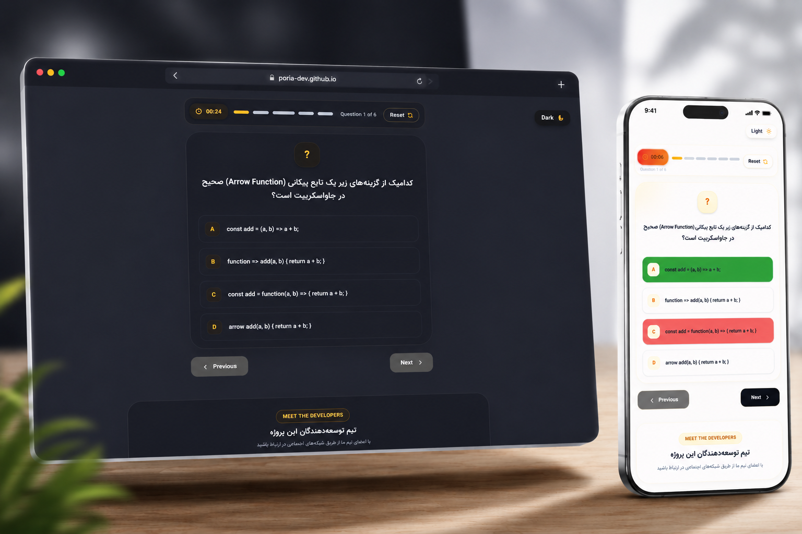

<div align="center">

# 🚀 SmartQuiz

### 👥 First Team Project • 4 Developers


<p>
A modern, responsive and interactive Quiz Application built with
<strong>HTML</strong>, <strong>Tailwind CSS</strong> and
<strong>Vanilla JavaScript</strong>.
</p>

<p>

<a href="https://poria-dev.github.io/Group_work/src">

</a>

<a href="https://github.com/poria-dev/Group_work">

</a>


</p>

</div>

---

# 📸 Preview

<p align="center">

<a href="https://poria-dev.github.io/Group_work/src">



</a>

</p>

> Click the image to open the Live Demo.

---

# 🌐 Live Demo

### 🔗 https://poria-dev.github.io/Group_work/src

---

# ✨ About Project

SmartQuiz is our **first collaborative project** developed by a team of **four developers**.

The project focuses on creating a clean, modern and responsive quiz platform while practicing professional teamwork using Git & GitHub.

---

# 🚀 Features

- 🎯 Interactive Quiz
- ⏱ Countdown Timer
- 📊 Progress Bar
- 🌙 Dark / Light Mode
- 📱 Fully Responsive
- ⚡ Smooth Animations
- 🔄 Reset Quiz
- 💡 Modern UI Design
- 🎨 Clean User Experience

---

# 🛠 Tech Stack

<div align="center">


</div>

---

# 📂 Folder Structure

```text
Group_work
│
├── src
│   ├── index.html
│   ├── app.js
│   ├── style.css
│   ├── assets
│   └── ...
│
├── demoimg.png
│
└── README.md
```

---

# 👨‍💻 Team Members

| Developer | Role |
|-----------|------|
| 👨‍💻 Developer 1 | Front-end |
| 👨‍💻 Developer 2 | JavaScript |
| 👨‍💻 Developer 3 | UI / UX |
| 👨‍💻 Pooria Rezaee | Front-end Developer |

---

# ⚙️ Installation

Clone the repository

```bash
git clone https://github.com/poria-dev/Group_work.git
```

Open project

```bash
cd Group_work
```

Run

```bash
Open src/index.html
```

---

# 🎯 Project Goals

- Learn Team Collaboration
- Practice Git & GitHub Workflow
- Improve JavaScript Skills
- Build Responsive Interfaces
- Experience Real Project Development

---

# ⭐ Support

If you enjoyed this project, don't forget to leave a ⭐ on the repository.

---

<div align="center">

## ❤️ Built with Teamwork

**Four Developers • One Project • One Goal 🚀**

</div>
